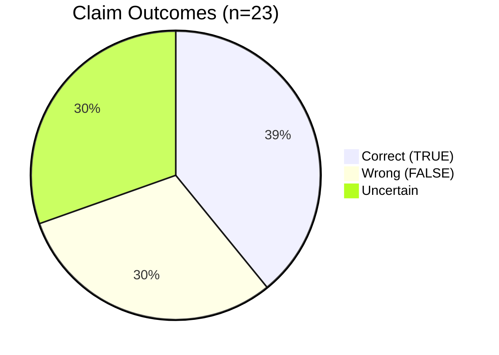
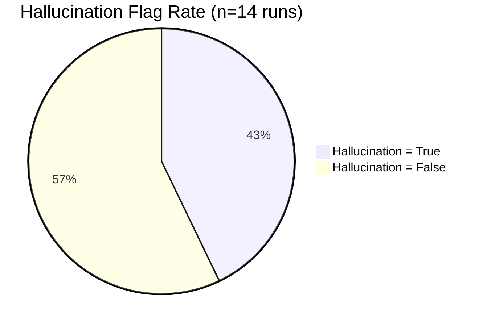
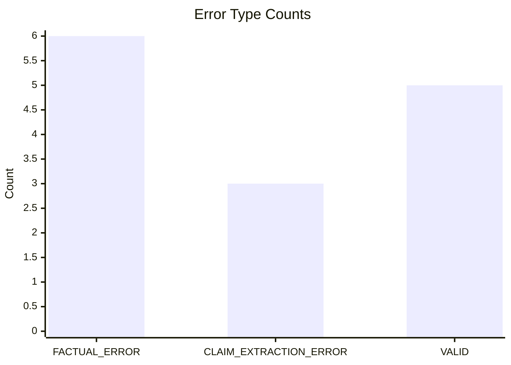

# AI Hall V1+V2 Verification Progress Dashboard

Generated from: `archive/logs/run_log.json`

## Snapshot
- Total runs: 14
- Total claims evaluated: 23
- Correct (TRUE): 9
- Wrong (FALSE): 7
- Uncertain: 7
- Hallucination flagged runs: 6 / 14 (42.86%)

## Claim Outcome Distribution

## Run-Level Hallucination Rate

## Error Type Mix

